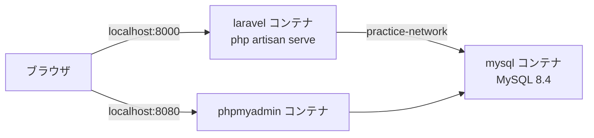
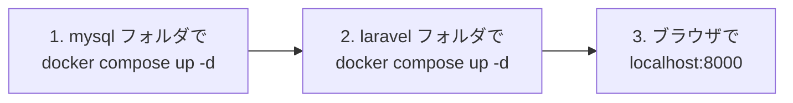

# Laravel × MySQL 練習環境（Docker）

Laravel と MySQL を、**別々のコンテナ** として起動します。
2つのコンテナは `practice-network` というネットワークでつながっています。



```
practice/
  mysql/
    compose.yaml    ← MySQL と phpMyAdmin
  laravel/
    compose.yaml    ← Laravel
    Dockerfile
    entrypoint.sh
    src/            ← 初回起動で Laravel が自動で作られる
```

> Docker Desktop を起動して、左下が **Engine running** になっていることを確認してから始めます。

> **XAMPP は止めておく**
> XAMPP を使っている場合は、XAMPP Control Panel を開き、動いているもの（Apache・MySQL など）をすべて **Stop** してから始めます。
> XAMPP の MySQL が動いていると、同じ `3306` 番ポートを使うので MySQL コンテナが起動できません。

---

## 1. 置き場所

C ドライブに `git` というフォルダを作り、その中にプロジェクトごとに入れていきます。

```
C:\git\practice
```

デスクトップに置いてもかまいません。

> **どこに保存したかを覚えておく**
> 起動や停止のたびに、そのフォルダへ `cd` で移動します。保存した場所がわからなくなると操作できません。

> **OneDrive の中は避ける**
> `C:\Users\<ユーザー名>\OneDrive\...` の中に置くと、同期とぶつかって遅くなったり、エラーになったりします。
> PC によってはデスクトップが OneDrive の中にあるので、迷ったら `C:\git` に置きます。

---

## 2. 起動する（順番が大事）

**必ず mysql → laravel の順番** で起動します。
ネットワーク `practice-network` は mysql 側で作られるからです。



PowerShell で実行します。（`C:\git\practice` 以外に置いた場合は、保存した場所に読みかえます）

```powershell
cd C:\git\practice\mysql
docker compose up -d
```

```powershell
cd C:\git\practice\laravel
docker compose up -d
```

**初回だけ**、Laravel のインストールに数分かかります。進み具合は次のコマンドで見られます（`Ctrl + C` で見るのをやめる）。

```powershell
docker compose logs -f
```

`Server running on [http://0.0.0.0:8000]` と表示されたら準備完了です。

| 開くURL | 表示されるもの |
|---------|--------------|
| http://localhost:8000 | Laravel のトップページ ✅ |
| http://localhost:8080 | phpMyAdmin（`laravel` データベースにテーブルができている ✅） |

---

## 3. 止める

起動したときの **逆の順番**（laravel → mysql）で止めます。

```powershell
cd C:\git\practice\laravel
docker compose down
```

```powershell
cd C:\git\practice\mysql
docker compose down
```

`down` してもデータベースの中身は消えません（`mysql-data` ボリュームに残っています）。

---

## 4. 接続情報

| 項目 | Laravel から | PC（A5:SQL Mk-2 など）から |
|------|-------------|--------------------------|
| ホスト | `mysql` | `127.0.0.1` |
| ポート | `3306` | `3306` |
| データベース | `laravel` | `laravel` |
| ユーザー名 | `laravel` | `laravel` |
| パスワード | `password` | `password` |

PC 側のポートは XAMPP の MySQL と同じ `3306` です。そのため、XAMPP の MySQL は止めておきます。
Laravel の設定は `laravel/src/.env` に書かれています。

---

## 5. artisan コマンドを使う

`php artisan` は、laravel コンテナの中で実行します。laravel フォルダで次のように打ちます。

```powershell
docker compose exec laravel php artisan migrate
docker compose exec laravel php artisan make:controller TodoController
```

---

## 6. うまくいかないとき

| 症状 | 対処 |
|------|------|
| `network practice-network declared as external, but could not be found` | mysql を先に起動していない → mysql フォルダで `docker compose up -d` |
| ログに `MySQL の起動を待っています...` が続く | mysql コンテナが動いているか、Docker Desktop の `Containers` で確認 |
| `port is already allocated`（ポートが使われている） | XAMPP Control Panel で MySQL などを Stop する。`php -S` など、同じポートを使うものも止める |
| 初回のインストールが途中で失敗した | laravel フォルダで `docker compose down` → `src` フォルダを削除 → もう一度 `docker compose up -d` |
| データベースを最初からやり直したい | mysql フォルダで `docker compose down -v`（**データが全部消えます**） |
